# terraform-aks-platform

Portfolio project: a production-shaped AKS-on-Azure platform, provisioned end-to-end with Terraform and GitHub Actions - no local `terraform apply` in the loop.

Designed to be `apply`ed, demoed, and `destroy`ed the same day. Not a long-running install.

Companion to [terraform-eks-platform](https://github.com/bibigon14/terraform-eks-platform) and [terraform-gke-platform](https://github.com/bibigon14/terraform-gke-platform) - same shape, different cloud.

## Real bugs caught by CI

One bootstrap of this repo against a fresh free-trial Azure subscription surfaced five distinct failures, in order. Four were caught in CI before any resource ended up in a bad state. All are documented with the real error text in [bootstrap.md](bootstrap.md#full-gotcha-chain-summary).

### 1. OIDC subject claim drift (PR plan)

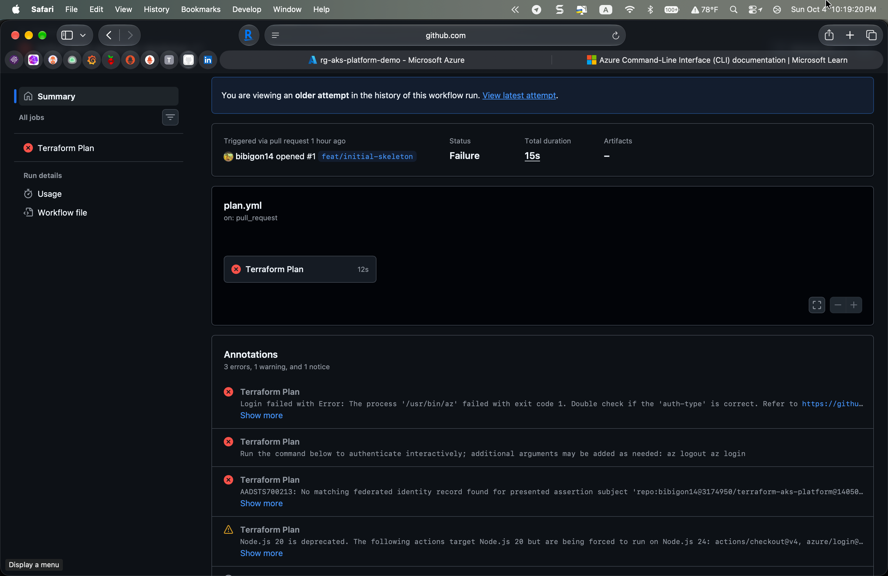

```
Federated token details:
 subject claim - repo:bibigon14@3174950/terraform-aks-platform@1405097511:pull_request

##[error]AADSTS700213: No matching federated identity record found for
presented assertion subject
'repo:bibigon14@3174950/terraform-aks-platform@1405097511:pull_request'.
```

GitHub emitted a **customized** subject claim with embedded user and repo IDs, but the federated credentials had been registered with the documented bare `repo:OWNER/REPO:pull_request` form. Azure AD refused the token because the subjects did not match.

**Root cause**. GitHub rolls out immutable actor identifiers in OIDC tokens over time. When active, the plain subject form that every tutorial uses no longer matches the claim that is actually presented. The fix is to register FCs with the exact subject the Azure CLI error prints, including the `@USER_ID` and `@REPO_ID` segments.

**Why plan catches it**. Local `terraform plan` and `validate` are both clean. The bug lives in the gap between CI-side OIDC token minting and Azure AD's federated-identity matching - a layer no local tool exercises.

### 2. K8s version regional deprecation (apply #1)

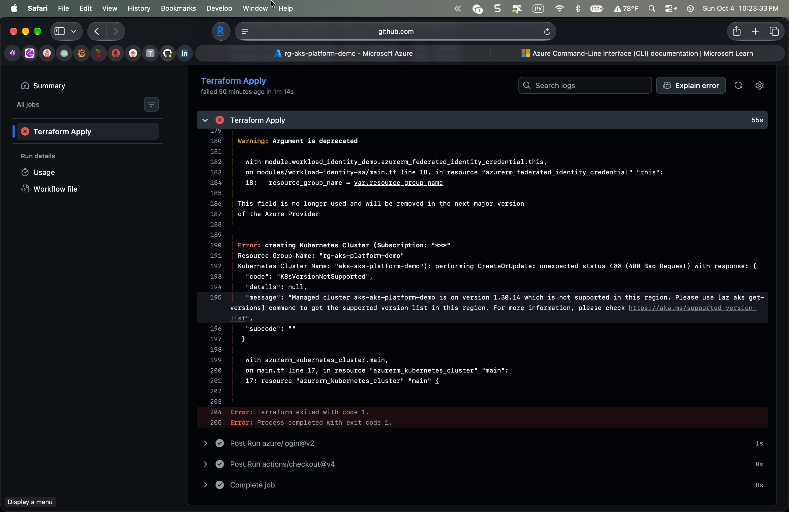

```
Error: creating Kubernetes Cluster ...
"code": "K8sVersionNotSupported",
"message": "Managed cluster aks-aks-platform-demo is on version 1.30.14
which is not supported in this region..."
```

The repo pinned `kubernetes_version = "1.30"` as a minor. AKS resolved that to the latest patch (`1.30.14`), which was already deprecated in `westus3` by the time apply ran. A supported minor fixes it.

**Why it matters**. "Pin the minor and let AKS pick the patch" is the pattern most tutorials recommend. It still breaks when the minor itself ages out of a specific region. Dependabot or similar automation that bumps the minor on a schedule is the real fix.

### 3. Free trial VM size restrictions (apply #2)

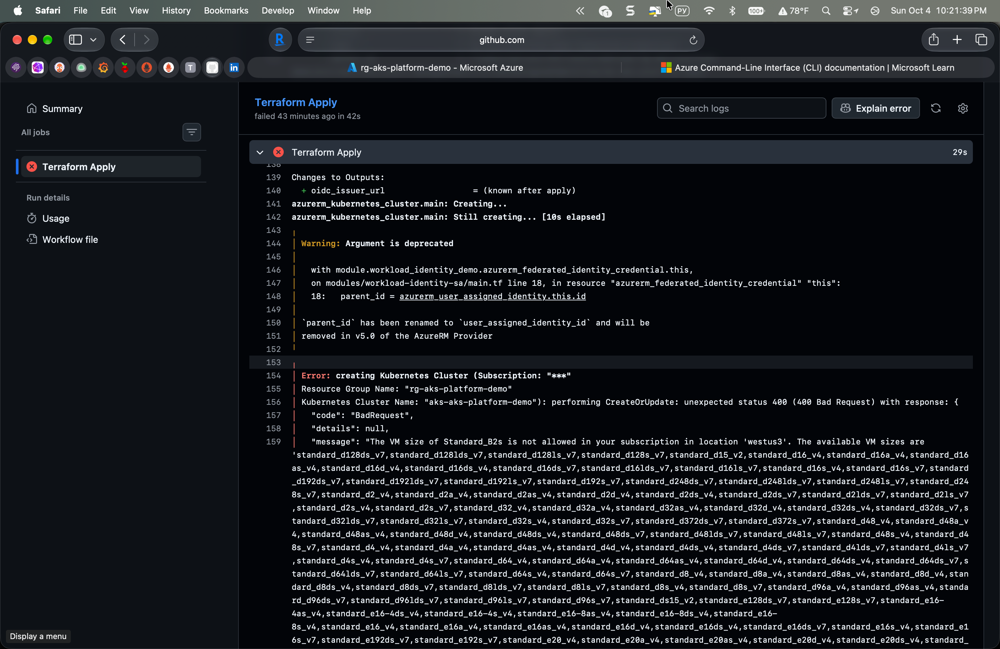

```
"code": "BadRequest",
"message": "The VM size of Standard_B2s is not allowed in your subscription
in location 'westus3'. The available VM sizes are 'standard_d128ds_v7,
standard_d128lds_v7, [~400 SKUs] ... standard_nv72ads_a10_v5'
```

Free trial subscriptions deny the entire B-series (burstable) tier in several US regions. The allowed list in the error has every other series - just not the cheap one most AKS quickstarts default to. Switching to `Standard_D2s_v4` (2 vCPU, 8 GB RAM) fits the free trial budget and is on-allowlist in every US region.

**Why it fires late**. ARM accepts the plan happily; the restriction is enforced on the actual VMSS create call inside the cluster create API. A pure plan cannot catch it.

### 4. kubelogin required for AAD-enabled clusters (post-deploy)

After `az aks get-credentials`:

```
Unable to connect to the server: getting credentials: exec: executable
kubelogin not found

kubelogin is not installed which is required to connect to AAD enabled cluster.
```

AKS clusters with Azure AD RBAC enabled write kubeconfigs that expect a `kubelogin` binary to broker AAD token exchange - it is NOT installed by `az aks install-cli` reliably across platforms, and NOT the kubectl default auth plugin. Install via `brew install Azure/kubelogin/kubelogin` and run `kubelogin convert-kubeconfig -l azurecli` to use the current Azure CLI session instead of interactive device-code login.

**Why most tutorials skip this**. Public AKS quickstarts use local-accounts auth, which does not need kubelogin. The moment you turn on AAD RBAC - which this repo does, because it is the right thing to do - the kubeconfig becomes incompatible with vanilla kubectl.

### 5. Self-service RBAC admin bootstrap (post-deploy)

After kubelogin is working:

```
Error from server (Forbidden): nodes is forbidden: User "<object-id>"
cannot list resource "nodes" in API group "" at the cluster scope: User
does not have access to the resource in Azure. Update role assignment to
allow access.
```

With `azure_rbac_enabled = true` and `admin_group_object_ids = []`, nobody has cluster-level Azure RBAC. The Terraform deploy SP has `Role Based Access Control Administrator` at subscription scope - it can grant roles - but has no cluster role itself, and neither does the signed-in user. The current user grants themselves `Azure Kubernetes Service RBAC Cluster Admin` on the cluster scope. Azure RBAC propagation is 2 to 5 minutes.

**The real fix for teams**. Pass an Entra ID group's object ID to `admin_group_object_ids` in `terraform.tfvars` and let Terraform grant it automatically. For a solo portfolio repo, the one-shot manual grant is the simplest path.

## Final cluster state

Two D2s_v4 nodes on k8s 1.35.7, OIDC issuer enabled, Workload Identity enabled, Azure RBAC enabled.

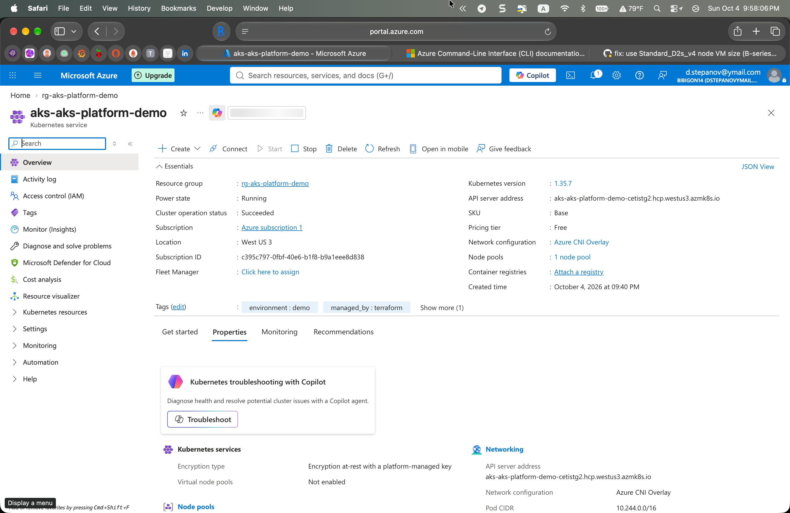
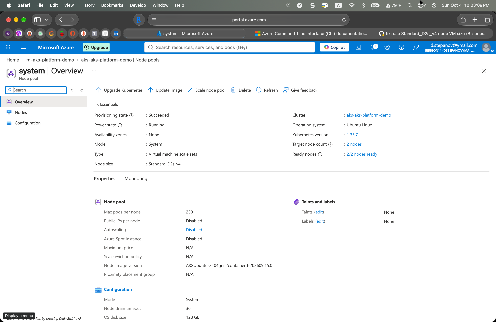
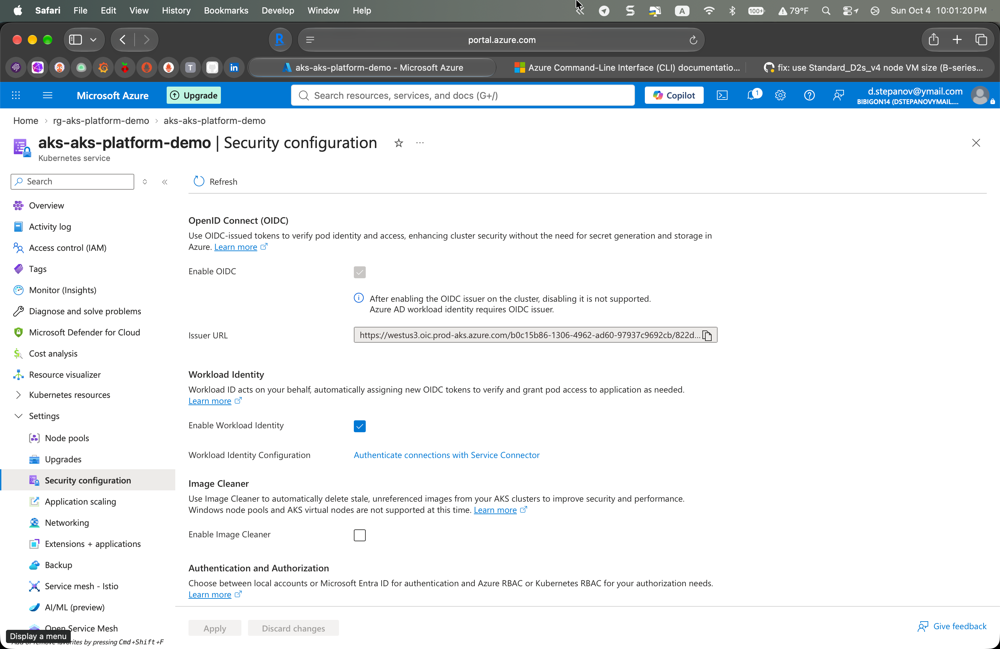
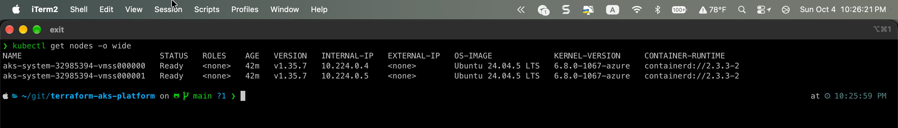

Full end-to-end chain, from PR plan through five fixes to a running cluster, is visible in the Actions tab:

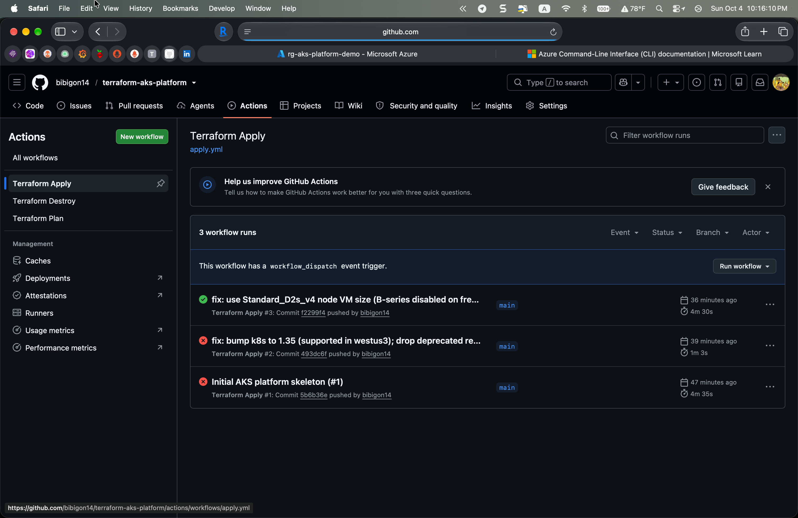
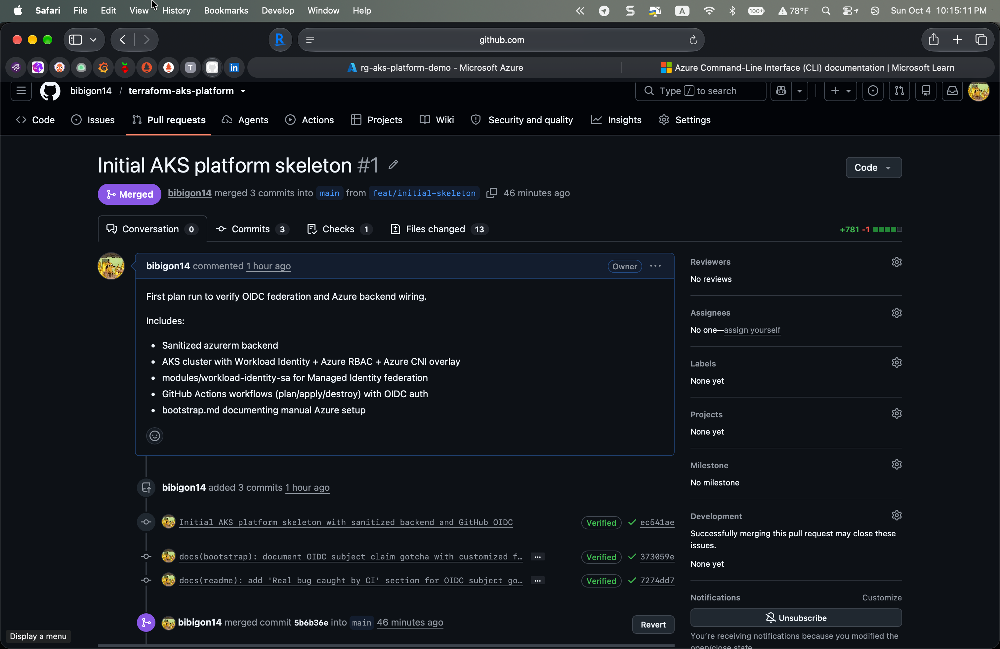
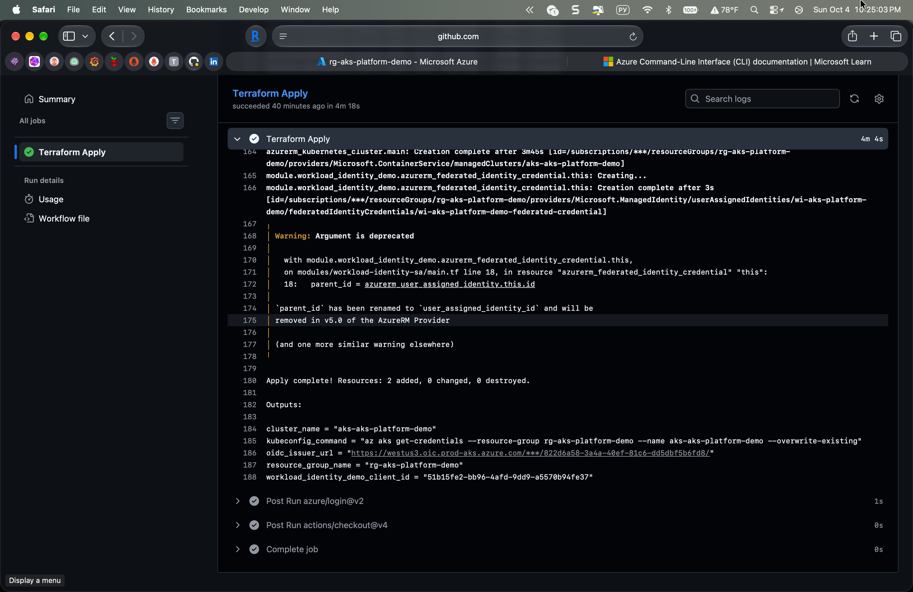

Lifecycle completes with a clean teardown:

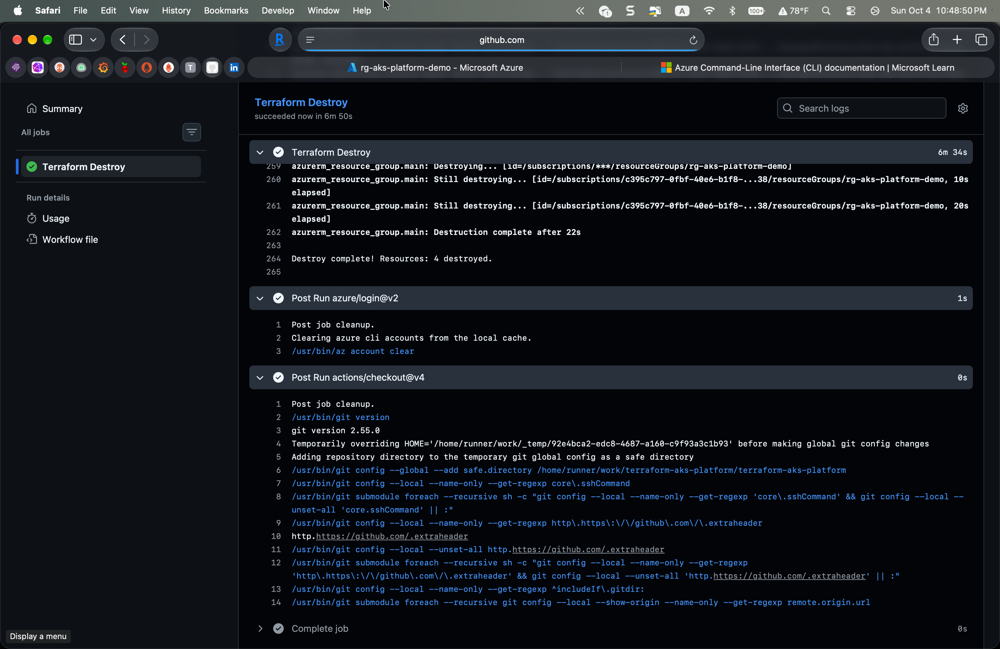


## Walkthrough

_TODO: Added after first clean end-to-end apply._

## Architecture

```
GitHub PR  ─────────────────────────────────┐
                                            │
                                   plan.yml (OIDC)
                                            │
                                            ▼
                                  ┌──────────────────┐
                                  │  Azure App Reg   │
                                  │  (federated SP)  │
                                  └────────┬─────────┘
                                           │
                                           ▼
                            ┌───────────────────────────────┐
                            │  Terraform state in           │
                            │  Azure Blob (sanitized backend) │
                            └───────────────┬───────────────┘
                                            │
                     push to main → apply.yml (production env gated)
                                            │
                                            ▼
                            ┌───────────────────────────────┐
                            │  Resource Group               │
                            │   └─ AKS cluster              │
                            │       ├─ OIDC issuer          │
                            │       ├─ Workload Identity    │
                            │       └─ Azure RBAC           │
                            │   └─ User-assigned Managed    │
                            │      Identity (federated to a │
                            │      k8s ServiceAccount)      │
                            └───────────────────────────────┘
```

## Bootstrap

Manual steps to prepare Azure for Terraform are in [`bootstrap.md`](bootstrap.md). Run once per subscription:

- Register resource providers (`Microsoft.ContainerService`, `Microsoft.Network`, `Microsoft.Storage`, `Microsoft.ManagedIdentity`)
- Resource group and storage account for Terraform state
- App Registration and federated credentials for GitHub OIDC
- Role assignments on the subscription (`Contributor` + `Role Based Access Control Administrator`)
- GitHub repo secrets, variables, and the `production` environment with a reviewer gate

Once bootstrap is done, all `plan` / `apply` / `destroy` happens through the workflows in [`.github/workflows/`](.github/workflows/) - triggered by PRs (plan), merges to `main` (apply, gated by the `production` environment reviewer), and manual dispatch (destroy).

## Cost and lifecycle

Full apply → demo → destroy cycle typically completes in under 25 minutes and costs under $2 on the Azure $200 free trial credit. AKS control plane is free; two `Standard_B2s` nodes at roughly $0.03/hr each account for most of the bill.

## Workload Identity demo

The main module provisions a user-assigned Managed Identity federated to a Kubernetes ServiceAccount at `default/demo-workload`. To use it from inside the cluster:

1. Create the namespace and ServiceAccount with the `azure.workload.identity/client-id` annotation set to the `workload_identity_demo_client_id` output
2. Add the `azure.workload.identity/use: "true"` label to any pod that should assume this identity
3. Give the Managed Identity whatever Azure RBAC it needs (e.g., `Key Vault Secrets User` on a Key Vault) via `azurerm_role_assignment` outside this module

That gives a pod the ability to call Azure APIs with no secret, no password, no service principal key in the cluster.

## Follow-ups (v2 backlog)

- Scope the deploy service principal from `Contributor` down to per-resource permissions
- Private AKS cluster (`private_cluster_enabled = true` with Private Link to the API server)
- `tflint` + `trivy` in CI
- Pre-commit hooks with `terraform fmt` + `terraform validate`
- Container Insights via a Log Analytics workspace
- A real demo workload (Kubernetes Deployment + Service) using the Managed Identity to read from Key Vault
- Separate state keys for a networking-only module and a cluster-only module, so one can be redeployed without the other
